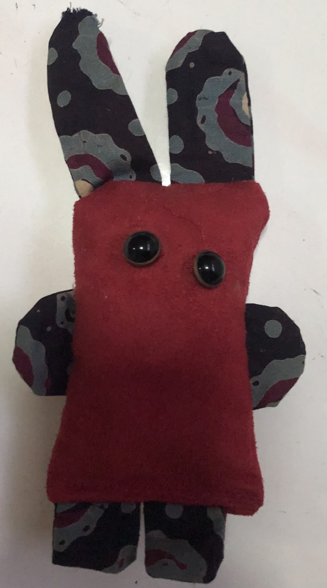

# Seevasant Indran

 &nbsp; &nbsp; 

---

I develop high-throughput platform for human gene variant functionalization — building tools to screen and characterise cancer genetic variants at scale. Currently learning, exploring and reseaching AI tool(s) and figuring out where they fit into all of this.

---

## Repos

| Repository | Description |
| :--- | :--- |
| [DMA_shiny](https://github.com/zeeva85/DMA_shiny) | Shiny app for DMA (Deletion mutant array) & Animated growth visualization for 96-well plate — [live ↗](https://zeeva85.shinyapps.io/DMA_shiny/) |

---  
  
## Debugging duck

  
**Not quite a duck.**  
Debugging companion. Stares. Judges. Occasionally helps.

 

---

